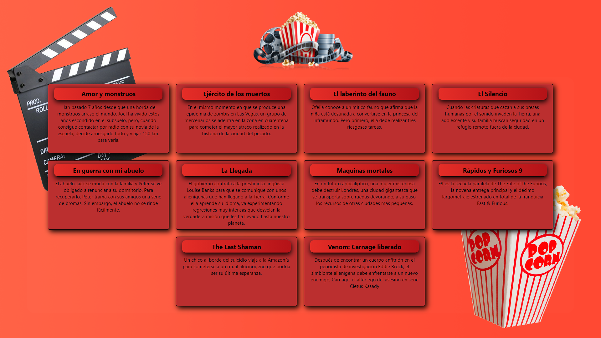

# React Lifecycle and Axios

Universidad Tecnológica Nacional BA
This is an university work with React (U3-M5) Lifecycle and Axios (connection with the server)

### Install dependencies

`npm install`

### Run the App
`npm start`

📷 Preview 

📋 Task 

Crear uno o varios componentes que se conecten a tu servidor express de Libros y que
muestre el listado de todos los libros cargados en el servidor.